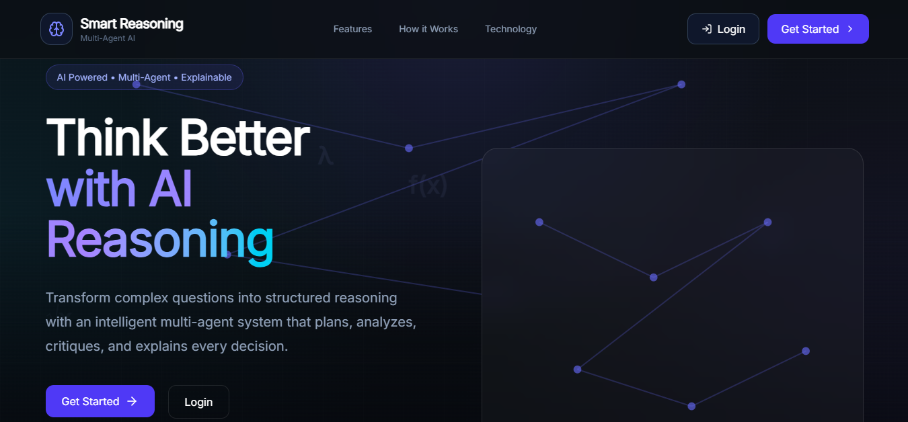
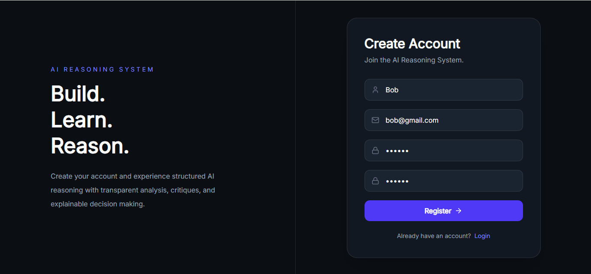
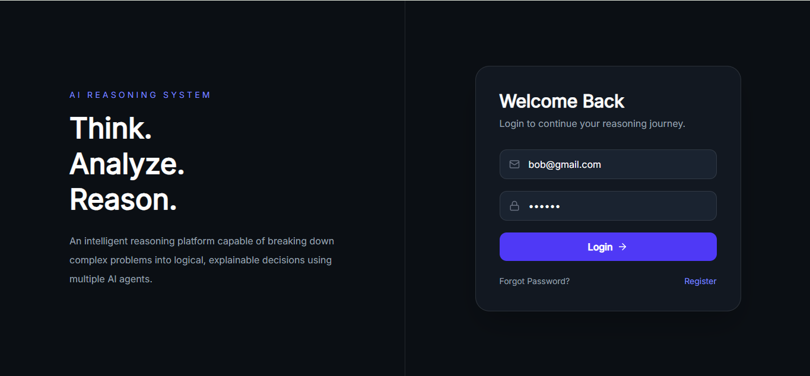
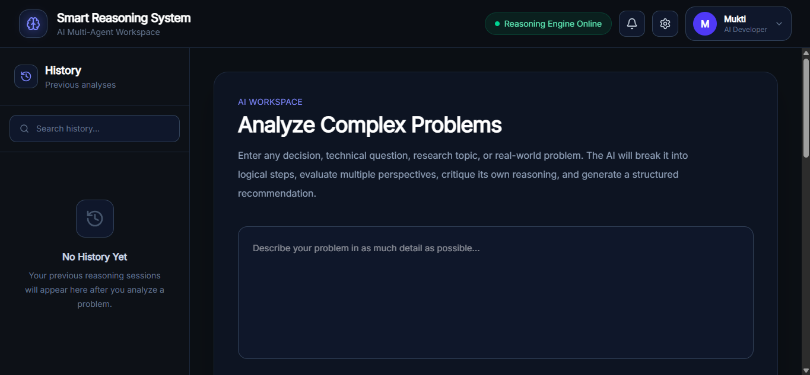
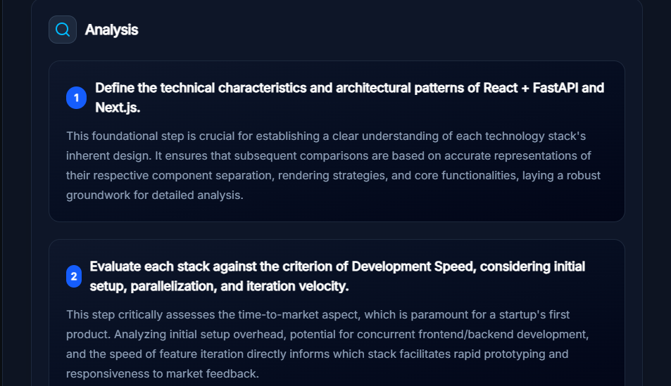
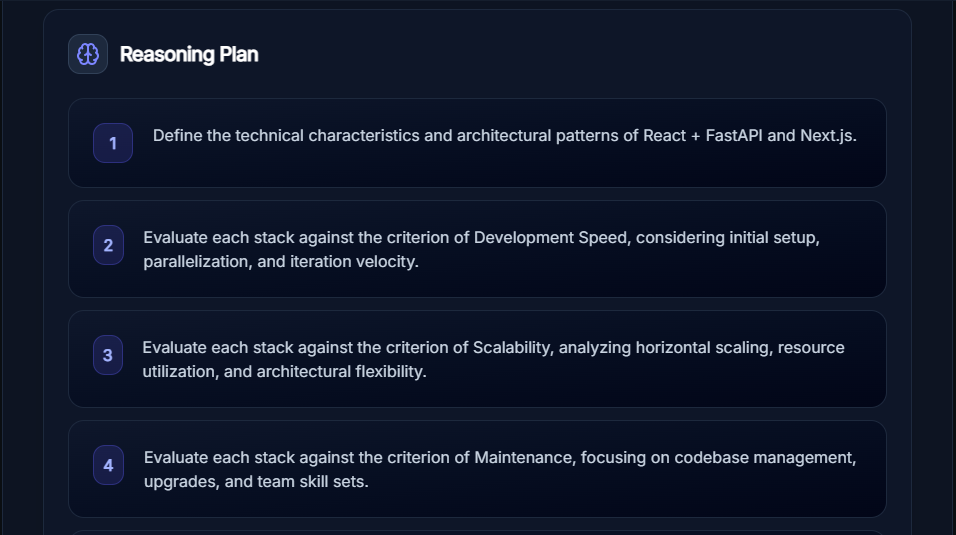
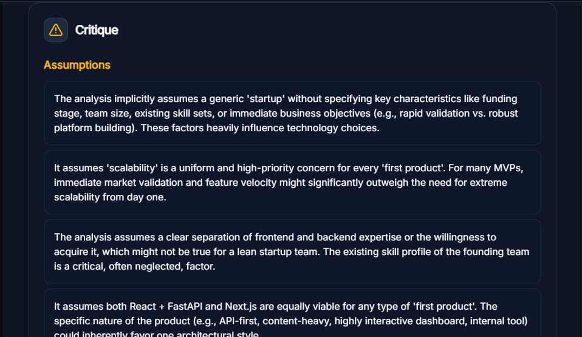
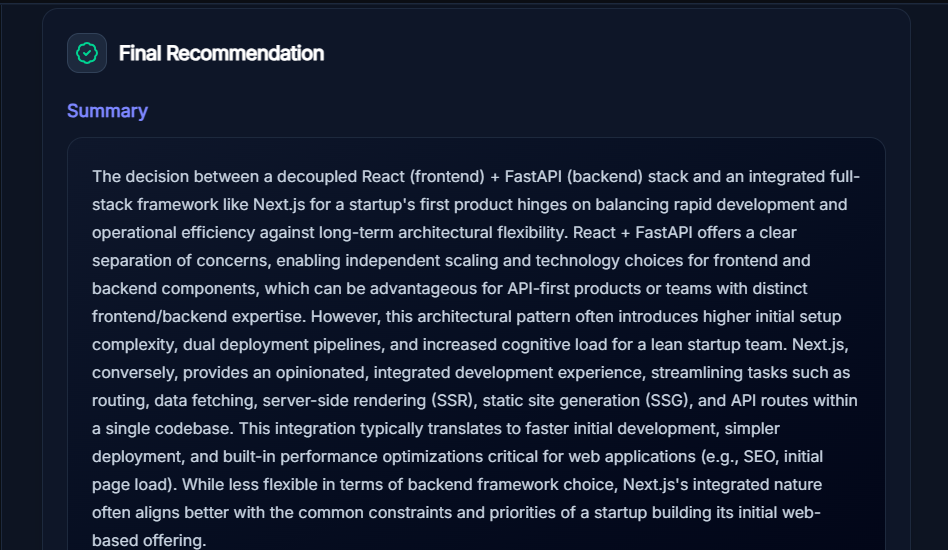
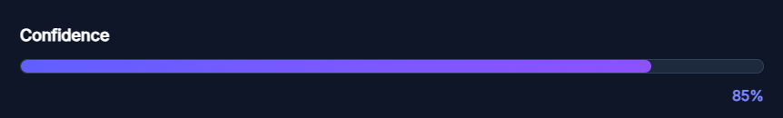
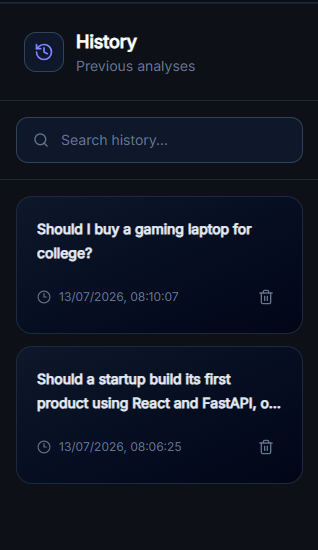

# Smart Reasoning System

> **An AI-powered multi-agent reasoning platform that transforms complex problems into structured, explainable decisions.**

Smart Reasoning System is a full-stack AI web application that demonstrates how multiple AI agents can collaborate to solve complex problems in a transparent and explainable way.

Instead of generating a direct answer, the system follows a structured reasoning pipeline where different AI agents perform specialized tasks such as planning, reasoning, self-critique, explanation, and recommendation generation.

The application is built with a modern React frontend, a FastAPI backend, and integrates Large Language Models to provide explainable AI reasoning.

---

# Preview


## Landing Page


## Register Page


## Login Page


## Dashboard Page


## AI Analysis
### Analyis

### Resoning

### Critique

### Final Recommendation

### Confidence Meter


## History Panel



---

# Features

### Multi-Agent AI Reasoning

The application simulates multiple AI agents working together.

Current reasoning pipeline includes:

* Planner Agent
* Reasoning Agent
* Critic Agent
* Recommendation Agent

Each agent performs a dedicated task before producing the final recommendation.

---

### Explainable AI

Unlike traditional chatbots, every response includes:

* Planning steps
* Detailed reasoning
* Self critique
* Missing information
* Risks
* Follow-up questions
* Final recommendation
* Confidence score

The user can understand **why** the AI reached a particular conclusion.

---

### Interactive Dashboard

Authenticated users receive a complete reasoning workspace including:

* History Sidebar
* Workspace
* Search History
* Delete History
* Analysis Viewer
* Confidence Meter
* Recommendation Panel

---

### Authentication

Secure authentication system includes:

* User Registration
* User Login
* Protected Routes
* JWT Authentication
* Persistent Sessions

---

### Analysis History

Every reasoning request is stored.

Users can:

* View previous analyses
* Search analyses
* Delete analyses
* Reopen previous reasoning sessions

---

### User Settings

Customizable application settings include:

* Reasoning Depth
* Response Style
* Agent Selection
* Auto Save History
* Animation Preferences
* Workspace Preferences

Settings are persisted locally.

---

### Notification System

Context-based notification system for:

* Login Success
* Logout
* User Events

---

### Modern UI

The frontend is designed using:

* Glassmorphism
* Gradient backgrounds
* Framer Motion animations
* Responsive layout
* Reusable UI components
* Dark theme interface

---

# Architecture

```
                    User Problem
                         │
                         ▼
                 Planner Agent
                         │
                         ▼
                Reasoning Agent
                         │
                         ▼
                  Critic Agent
                         │
                         ▼
             Recommendation Agent
                         │
                         ▼
                 Final AI Response
                         │
                         ▼
               Saved to User History
```

---

# Tech Stack

## Frontend

* React 19
* React Router
* Tailwind CSS v4
* Framer Motion
* Axios
* Lucide React
* Context API
* Vite

---

## Backend

* FastAPI
* Python
* Uvicorn
* Pydantic
* JWT Authentication
* SQLAlchemy
* SQLite
* Passlib
* Python-dotenv

---

## AI

* Large Language Model API
* Multi-Agent Prompting
* Structured JSON Responses
* Explainable AI Pipeline

---

# Project Structure

```
smart-reasoning-system/

│
├── backend/
│   ├── app/
│   ├── routers/
│   ├── models/
│   ├── services/
│   ├── database/
│   ├── auth/
│   ├── schemas/
│   └── main.py
│
├── frontend/
│   ├── src/
│   │
│   ├── api/
│   ├── components/
│   ├── context/
│   ├── pages/
│   ├── lib/
│   ├── assets/
│   └── App.jsx
│
└── README.md
```

---

# Installation

## Clone Repository

```bash
git clone https://github.com/muktig2703-dot/smart-reasoning-system

cd smart-reasoning-system
```

---

# Backend Setup

Create virtual environment

```bash
python -m venv venv
```

Activate environment

Windows

```bash
venv\Scripts\activate
```

Install dependencies

```bash
pip install -r requirements.txt
```

Create a `.env` file

```env
OPENROUTER_API_KEY=your_api_key
SECRET_KEY=your_secret_key
ALGORITHM=HS256
ACCESS_TOKEN_EXPIRE_MINUTES=60
```

Run backend

```bash
uvicorn app.main:app --reload
```

Backend runs at

```
http://127.0.0.1:8000
```

Swagger Documentation

```
http://127.0.0.1:8000/docs
```

---

# Frontend Setup

Install dependencies

```bash
npm install
```

Run application

```bash
npm run dev
```

Frontend runs at

```
http://localhost:5173
```

---

# Authentication Flow

```
Register

↓

Login

↓

Receive JWT

↓

Token Stored

↓

Protected Dashboard

↓

Reasoning Workspace
```

---

# Reasoning Flow

```
Problem

↓

Planning

↓

Reasoning

↓

Critique

↓

Recommendation

↓

Confidence Score

↓

History Saved
```

---

# API Overview

### Authentication

```
POST /register

POST /login

GET /users/me
```

---

### Reasoning

```
POST /reasoning/analyze
```

---

### History

```
GET /history

GET /history/search

DELETE /history/{id}
```

---

# Screens Included

The application includes the following pages:

* Landing Page
* Login
* Register
* Dashboard
* Workspace
* History Sidebar

---

# Key Highlights

* Full Stack AI Application
* Explainable AI
* Multi-Agent Architecture
* JWT Authentication
* React Context API
* Modern Dashboard
* Searchable History
* Persistent User Settings
* Responsive Interface
* Clean Component Architecture

---

# Learning Outcomes

This project demonstrates practical experience with:

* Full Stack Development
* React Architecture
* FastAPI Development
* Authentication Systems
* REST APIs
* AI Integration
* Prompt Engineering
* State Management
* Modern UI Development
* Component-Based Design

---

# Future Scope

Possible future enhancements include:

* Multiple AI model support
* Real-time streaming responses
* Team collaboration
* Export reasoning reports
* Cloud database integration
* User profile management
* AI agent customization
* Conversation memory

---

# Author

**Mukti Gupta**
B.Tech Artificial Intelligence & Machine Learning

---

# License

This project is developed for educational and portfolio purposes.